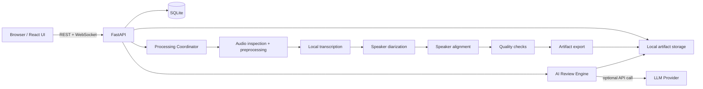
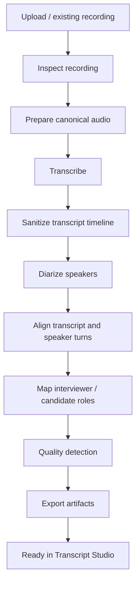
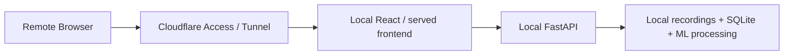

# Interview Intelligence

A **local-first interview analysis workspace** for turning interview recordings into searchable, speaker-labelled transcripts and structured AI feedback.

Interview Intelligence keeps the expensive audio-processing pipeline on your machine, gives you synchronized transcript/audio playback, and can optionally use an LLM for question-by-question interview review.

> **Project status:** active development / local-first MVP.  
> The current implementation has been validated primarily on **macOS + Apple Silicon**.

---

## What it does

Upload an interview recording and Interview Intelligence can:

- normalize audio into a canonical format;
- transcribe long recordings locally;
- identify and label interviewer/candidate speakers;
- align speaker turns with transcript timestamps;
- detect obvious transcript quality problems;
- persist jobs so long-running processing survives browser/frontend restarts;
- show live processing state and elapsed time;
- play the original recording and seek by clicking transcript segments;
- download the generated transcript;
- generate a structured AI interview review;
- score individual questions and highlight strengths, gaps, and stronger answers;
- store interviews, processing history, transcripts, review artifacts, and metadata locally;
- delete an interview and its app-managed artifacts safely.

The long-term goal is not merely "transcribe an interview." It is to build **cross-interview intelligence** that identifies recurring patterns, progress, weaknesses, and what to practice next.

---

## Screens

The current product includes:

- **Interview Workspace** — all interview rounds, status, duration, processing progress, search and actions.
- **Transcript Studio** — synchronized audio playback plus speaker-labelled transcript.
- **AI Review** — overall hiring signal, evidence summary, coaching guidance, question-by-question review and level signal.
- **Collapsible navigation** — more horizontal room for transcript and analysis content.

---

## Architecture at a glance



The application is intentionally split into two concerns:

1. **Local media intelligence** — transcription, diarization, alignment and artifacts stay on the machine.
2. **Optional AI reasoning** — structured interview review can call an external LLM provider.

See [Architecture](docs/ARCHITECTURE.md) for the detailed design.

---

# Quick start

## 1. System requirements

### Validated environment

| Requirement | Recommended |
|---|---|
| Operating system | macOS |
| CPU | Apple Silicon (M-series) |
| RAM | 16 GB minimum; 32 GB recommended for long recordings |
| Python | 3.11 |
| Python package manager | `uv` |
| Node.js | 20+ recommended |
| npm | bundled with Node.js |
| FFmpeg | current Homebrew version |
| Disk | several GB free for model cache + recordings |
| Browser | current Chrome / Chromium / Safari |

### Why Apple Silicon?

The current transcription implementation uses **MLX Whisper**, and speaker diarization can use Apple's **MPS** acceleration. This is currently the best-tested path.

Linux/CUDA support can be added later, but should currently be considered **unverified** rather than guaranteed.

---

## 2. Install host dependencies

### Homebrew

```bash
brew install ffmpeg
brew install uv
brew install node
```

Verify:

```bash
ffmpeg -version
uv --version
node --version
npm --version
```

---

## 3. Clone the repository

```bash
git clone <YOUR_GITHUB_REPOSITORY_URL>
cd interview-intelligence
```

---

## 4. Install backend dependencies

The backend uses `uv`.

```bash
uv sync
```

Verify the environment:

```bash
uv run python --version
```

Expected: Python 3.11.x.

---

## 5. Configure Hugging Face access for diarization

Speaker diarization currently uses:

```text
pyannote/speaker-diarization-community-1
```

The model is gated.

1. Create/sign in to a Hugging Face account.
2. Accept the model's access conditions.
3. Create a Hugging Face access token.
4. Authenticate locally.

For example:

```bash
uv run huggingface-cli login
```

Or configure the token using the mechanism supported by your local Hugging Face installation.

If access is missing, diarization will fail with a `401 Unauthorized` / `GatedRepoError`.

The first diarization run downloads the model files. Later runs use the local cache and are significantly faster.

---

## 6. Optional: configure AI Review

Transcription and diarization work locally without an OpenAI key.

AI Review currently supports an OpenAI-backed review engine.

Set the key only in your shell/environment:

```bash
export OPENAI_API_KEY="..."
```

Do **not** commit API keys.

You can verify configuration without printing the secret:

```bash
uv run python - <<'PY'
import os
print("OPENAI_API_KEY configured:", bool(os.getenv("OPENAI_API_KEY")))
PY
```

The review model can be overridden with:

```bash
export INTERVIEW_INTELLIGENCE_REVIEW_MODEL="<model-name>"
```

> API analysis consumes paid API credits. Cost/usage visibility and cheaper default review models are on the roadmap.

---

# Running the app

Use two terminals.

## Terminal 1 — backend

From the repository root:

```bash
uv run uvicorn interview_intelligence.api.app:app \
  --host 127.0.0.1 \
  --port 8000
```

Backend:

```text
http://127.0.0.1:8000
```

Swagger:

```text
http://127.0.0.1:8000/docs
```

Swagger is useful for inspecting and manually testing REST endpoints.

---

## Terminal 2 — frontend

```bash
cd frontend
npm install
npm run dev
```

Frontend:

```text
http://localhost:5173
```

For a production frontend build:

```bash
npm run build
```

---

# First-run workflow

1. Open `http://localhost:5173`.
2. Select **Add interview**.
3. Upload an audio recording.
4. Enter company, interviewer, role, round and interview date/time.
5. Start processing.
6. Leave the backend running while local transcription/diarization completes.
7. Open the completed interview.
8. Use **Transcript Studio** for synchronized audio/transcript playback.
9. Optionally run **AI Review**.

Long recordings are computationally expensive. A real ~79-minute interview has been successfully processed end-to-end on an Apple Silicon development machine in roughly tens of minutes; exact runtime depends on machine, model cache state and recording characteristics.

---

# Persistent local data

By default, Interview Intelligence stores application data under:

```text
~/Library/Application Support/InterviewIntelligence/
```

Typical layout:

```text
InterviewIntelligence/
├── app.db
└── recordings/
    ├── _uploads/
    └── <Company>/
        └── <Interview directory>/
            ├── original.wav
            ├── transcript.txt
            ├── transcript.json
            ├── metadata.json
            ├── quality.json
            └── review.json        # when AI Review has been run
```

`app.db` contains interview metadata and processing jobs.

The generated recording/artifact directory is managed by the application.

When deleting an interview:

- database metadata and processing history are removed;
- generated artifacts are removed;
- app-managed uploaded copies can be removed;
- an original recording outside Interview Intelligence's managed storage is intentionally preserved.

---

# Processing pipeline



Persisted job state includes:

- job status;
- pipeline stage;
- progress percentage;
- processed audio seconds;
- total audio duration;
- start/update/completion timestamps;
- failure information.

The frontend can recover an active job after a browser/frontend restart and reconnect to progress events.

---

# AI Review

AI Review produces a structured result rather than a free-form answer.

Current review output includes:

- overall summary;
- hiring signal;
- confidence;
- strengths;
- concerns;
- improvement areas;
- role signal;
- level signal;
- question-by-question extraction;
- answer summary;
- per-question strengths/gaps;
- stronger-answer guidance;
- rating;
- level signal.

The current review page presents this as:

```text
Verdict
  ↓
Evidence summary
  ↓
Coaching / improvement areas
  ↓
Question-by-question evidence
  ↓
Level assessment
```

The recording/audio player remains available above both Transcript and AI Review.

---

# API overview

The exact OpenAPI contract is always available at `/docs`.

Important endpoint families include:

```text
GET    /api/v1/interviews
POST   /api/v1/interviews
POST   /api/v1/interviews/upload
DELETE /api/v1/interviews/{interview_id}

POST   /api/v1/interviews/{interview_id}/process
GET    /api/v1/interviews/{interview_id}/jobs/latest
WS     /api/v1/jobs/{job_id}/events

GET    /api/v1/interviews/{interview_id}/transcript
GET    /api/v1/interviews/{interview_id}/audio

POST   /api/v1/interviews/{interview_id}/review
GET    /api/v1/interviews/{interview_id}/review
```

Use Swagger as the source of truth if endpoint details evolve.

---

# Development

## Backend quality gate

Run from repository root:

```bash
uv run pytest
uv run ruff check .
uv run mypy
```

## Frontend quality gate

```bash
cd frontend
npm run build
```

Before committing a feature, both backend and frontend checks should be green when the change touches both layers.

---

# Repository structure

```text
interview-intelligence/
├── README.md
├── ROADMAP.md
├── docs/
│   └── ARCHITECTURE.md
├── src/
│   └── interview_intelligence/
│       ├── api/
│       ├── application/
│       ├── audio/
│       ├── diarization/
│       ├── domain/
│       ├── engines/
│       ├── jobs/
│       ├── persistence/
│       ├── pipeline/
│       ├── quality/
│       ├── review/
│       └── transcription/
├── tests/
├── scripts/
├── benchmarks/
└── frontend/
    ├── src/
    ├── package.json
    └── vite.config.*
```

The codebase favors explicit domain/application boundaries over putting processing logic directly in FastAPI routes.

---

# Troubleshooting

## `401 Unauthorized` downloading pyannote

Symptoms:

```text
GatedRepoError
Cannot access gated repo
```

Fix:

- accept the model terms on Hugging Face;
- authenticate with a token that has access.

---

## Processing appears stuck

Check persisted job state:

```bash
sqlite3 -header -column \
"$HOME/Library/Application Support/InterviewIntelligence/app.db" \
'SELECT id, interview_id, status, stage, progress_percent,
        processed_audio_seconds, total_audio_seconds,
        started_at, updated_at, error_message
 FROM processing_jobs
 ORDER BY created_at DESC
 LIMIT 5;'
```

Long transcription operations can remain on one stage for several minutes while still actively using CPU/GPU.

Check the backend process:

```bash
ps -Ao pid,etime,%cpu,%mem,command | \
grep -E "uvicorn|Python|mlx|pyannote" | \
grep -v grep
```

---

## AI Review returns HTTP 500 / quota error

If the backend traceback contains:

```text
insufficient_quota
credit_balance_exhausted
```

the OpenAI API account needs available credits.

Provider errors should eventually be converted into cleaner application-level errors; see the roadmap.

---

## Frontend cannot reach the backend

Confirm:

```text
Backend:  http://127.0.0.1:8000
Frontend: http://localhost:5173
```

Check CORS configuration and ensure the FastAPI process is still running.

---

# Privacy

Interview recordings can contain highly sensitive personal and professional information.

The project is intentionally **local-first**:

- recordings are stored locally by default;
- transcription and diarization run locally;
- external sharing should be explicit;
- AI Review currently sends transcript content to the configured external LLM provider when invoked.

Do not run AI Review on content you are not allowed to send to that provider.

Authentication, encryption/retention policy, and secure remote access remain important roadmap items before exposing the application publicly.

---

# Remote access / Cloudflare

The project is currently designed to run on localhost.

A planned deployment path is **Cloudflare Tunnel** for securely reaching a locally running application without directly opening inbound ports on the machine.

Potential architecture:



Before enabling remote access, the project should add proper authentication/access control and review what endpoints/artifacts can be exposed.

Cloudflare is therefore a **roadmap item**, not part of the current required local setup.

See [ROADMAP.md](ROADMAP.md).

---

# Roadmap

The immediate roadmap includes:

- AI analysis loader, elapsed time, token usage and cost visibility;
- cheaper/default model strategy and provider abstractions;
- cross-interview intelligence and recurring-pattern detection;
- Cloudflare Tunnel + secure remote access;
- authentication;
- long-running job cancellation/retry;
- better transcription progress reporting;
- interview grouping and comparison;
- analysis/export improvements;
- production hardening.

Full detail: [ROADMAP.md](ROADMAP.md).

---

# Contributing

This project is still moving quickly. For now:

1. keep changes small and isolated;
2. add/update tests for backend behavior;
3. run the backend and frontend quality gates;
4. avoid committing recordings, API keys, model tokens or local databases;
5. document architectural decisions when introducing a new provider, storage backend or execution model.

---

# License

A license has not yet been selected.

Before publishing the repository broadly, add a `LICENSE` file and update this section.
