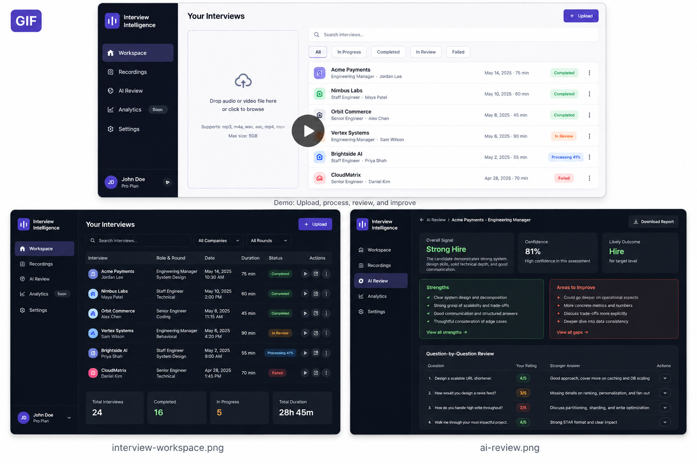
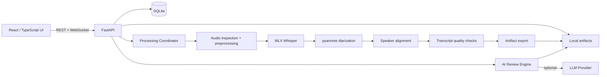
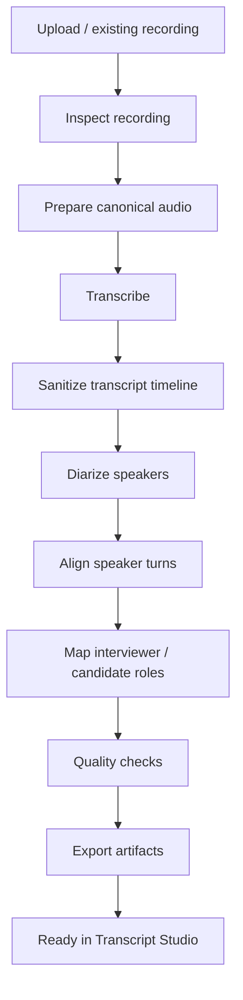

# Interview Intelligence 🎙️

<p align="center">
  <strong>Turn technical interviews into a private, searchable feedback loop.</strong>
</p>

<p align="center">
  Record → Transcribe locally → Review → Improve across interviews
</p>

<p align="center">
  
  
  
  
  
  
  
</p>

> **Status:** Active development · Local-first MVP  
> **Best-tested environment:** macOS + Apple Silicon

---

## Why this exists

Interview preparation is surprisingly fragmented.

A typical post-interview workflow looks like this:

1. replay the recording;
2. convert the file if needed;
3. find a transcription tool that can handle a 60–90 minute interview;
4. manually identify interviewer/candidate turns;
5. paste the transcript into an AI assistant;
6. re-explain the company, role and round;
7. ask for feedback;
8. lose that feedback inside another chat.

**Interview Intelligence turns that into one workflow.**

It keeps transcription and diarization local, preserves the original interview timeline, gives you synchronized audio + transcript playback, and can optionally generate structured AI feedback.

The long-term goal is bigger than transcription: **cross-interview intelligence** that identifies recurring weaknesses, strengths, trends and what to practice next.

---

## Product preview

### Demo

<p align="center">
  
</p>


---

## Features

### 🎙️ Local transcription
- High-quality local transcription using MLX Whisper
- Optimized for Apple Silicon
- Supports long-form interview recordings
- Preserves timestamps and original timeline

### 👥 Speaker diarization
- Speaker turn detection with `pyannote.audio`
- Interviewer / candidate role mapping
- Speaker-aware transcript segments

### ⏱️ Transcript Studio
- Timestamped transcript
- Audio playback
- Click a transcript segment to seek directly to that moment
- Download transcript
- Persisted artifacts for later inspection

### 🤖 AI Interview Review
- Overall hiring signal
- Confidence / evidence summary
- Strengths and gaps
- Improvement guidance
- Question-by-question ratings
- Stronger-answer suggestions
- Role / level signal

### 🧠 Reliable long-running processing
- Persisted processing jobs
- Real stage updates
- Elapsed-time tracking
- Browser/frontend restart recovery
- WebSocket progress updates

### 🔒 Local-first by default
- Audio and processing artifacts stay on your machine
- SQLite for structured local state
- External AI review is optional and explicit

---

## Tech stack

| Area | Technology |
|---|---|
| Frontend | React, TypeScript, Vite |
| Backend | Python 3.11, FastAPI |
| Local persistence | SQLite |
| Realtime progress | WebSockets |
| Transcription | MLX Whisper |
| Speaker diarization | pyannote.audio |
| Audio tooling | FFmpeg / ffprobe |
| AI review | OpenAI via pluggable review-engine interface |
| Python tooling | uv |
| Target hardware | Apple Silicon / MPS |

---

## Architecture



The application is intentionally split into:

1. **Local media intelligence** — transcription, diarization, alignment and artifact generation.
2. **Optional AI reasoning** — structured review through a provider abstraction.

For deeper details, see [`docs/ARCHITECTURE.md`](docs/ARCHITECTURE.md).

---

# Quick start

## 1. System requirements

| Requirement | Recommended |
|---|---|
| Operating system | macOS |
| CPU | Apple Silicon (M-series) |
| RAM | 16 GB minimum, 32 GB recommended |
| Python | 3.11 |
| Node.js | 20+ |
| Python package manager | `uv` |
| Audio tooling | FFmpeg |
| Browser | Chrome / Chromium / Safari |
| Disk | Several GB for models + recordings |

> Linux/CUDA support is not yet considered a validated path.

---

## 2. Install host dependencies

Using Homebrew:

```bash
brew install ffmpeg
brew install uv
brew install node
```

Verify:

```bash
ffmpeg -version
uv --version
node --version
npm --version
```

---

## 3. Clone the repository

```bash
git clone https://github.com/aryan000/interview-intelligence.git
cd interview-intelligence
```

---

## 4. Install backend dependencies

```bash
uv sync
```

Verify:

```bash
uv run python --version
```

Expected:

```text
Python 3.11.x
```

---

## 5. Configure Hugging Face access

Speaker diarization uses:

```text
pyannote/speaker-diarization-community-1
```

This is a gated model.

You must:

1. sign in to Hugging Face;
2. accept the model's access conditions;
3. create an access token;
4. authenticate locally.

Example:

```bash
uv run huggingface-cli login
```

If access is missing, diarization may fail with:

```text
401 Unauthorized
GatedRepoError
```

The first successful run downloads the model files. Warm runs are significantly faster.

---

## 6. Optional: configure AI Review

Local transcription and diarization do **not** require OpenAI.

To enable AI Review:

```bash
export OPENAI_API_KEY="..."
```

Do not commit API keys.

Verify without exposing the secret:

```bash
uv run python - <<'PY'
import os
print("OPENAI_API_KEY configured:", bool(os.getenv("OPENAI_API_KEY")))
PY
```

Optional model override:

```bash
export INTERVIEW_INTELLIGENCE_REVIEW_MODEL="<model-name>"
```

> AI Review consumes external API credits. Token/cost visibility and a cheaper default model strategy are tracked in the roadmap.

---

# Run the app

Use two terminals.

## Terminal 1 — backend

From the repository root:

```bash
uv run uvicorn interview_intelligence.api.app:app \
  --host 127.0.0.1 \
  --port 8000
```

Backend:

```text
http://127.0.0.1:8000
```

Swagger:

```text
http://127.0.0.1:8000/docs
```

---

## Terminal 2 — frontend

```bash
cd frontend
npm install
npm run dev
```

Frontend:

```text
http://localhost:5173
```

Production frontend build:

```bash
npm run build
```

---

# First-run workflow

1. Open `http://localhost:5173`
2. Click **Add interview**
3. Upload an audio recording
4. Enter company, interviewer, date/time, role and round
5. Start processing
6. Let the backend complete transcription + diarization
7. Open the completed interview
8. Use **Transcript Studio** for synchronized playback
9. Optionally run **AI Review**

Long recordings are compute-heavy. Processing time depends on hardware, model cache state and recording characteristics.

---

## Local data

Default application directory:

```text
~/Library/Application Support/InterviewIntelligence/
```

Typical layout:

```text
InterviewIntelligence/
├── app.db
└── recordings/
    ├── _uploads/
    └── <Company>/
        └── <Interview directory>/
            ├── original.wav
            ├── transcript.txt
            ├── transcript.json
            ├── metadata.json
            ├── quality.json
            └── review.json
```

`app.db` stores interview metadata and processing jobs.

When deleting an interview:

- database metadata is removed;
- generated artifacts are removed;
- app-managed uploaded copies can be removed;
- an original recording outside the managed application directory is intentionally preserved.

---

## Processing pipeline



Persisted job state includes:

- status;
- stage;
- progress;
- processed audio seconds;
- total duration;
- started / updated / completed timestamps;
- failure information.

The frontend can recover an active job after a browser or frontend restart.

---

## AI Review output

The review engine returns structured data rather than free-form prose.

Current output includes:

```text
Verdict
├── overall summary
├── hiring signal
├── confidence
├── strengths
├── concerns
├── improvement areas
├── role signal
└── level signal

Questions
├── interviewer question
├── answer summary
├── rating
├── strengths
├── gaps
├── stronger answer
└── level signal
```

The UI presents it as:

```text
Verdict
  ↓
Evidence summary
  ↓
Coaching
  ↓
Question-by-question review
  ↓
Level assessment
```

---

## API overview

The exact API contract is available through Swagger.

Important endpoint families:

```text
GET    /api/v1/interviews
POST   /api/v1/interviews
POST   /api/v1/interviews/upload
DELETE /api/v1/interviews/{interview_id}

POST   /api/v1/interviews/{interview_id}/process
GET    /api/v1/interviews/{interview_id}/jobs/latest
WS     /api/v1/jobs/{job_id}/events

GET    /api/v1/interviews/{interview_id}/transcript
GET    /api/v1/interviews/{interview_id}/audio

POST   /api/v1/interviews/{interview_id}/review
GET    /api/v1/interviews/{interview_id}/review
```

---

# Development

## Backend quality gate

```bash
uv run pytest
uv run ruff check .
uv run mypy
```

## Frontend quality gate

```bash
cd frontend
npm run build
```

Keep both green before merging changes that touch both layers.

---

## Repository structure

```text
interview-intelligence/
├── README.md
├── ROADMAP.md
├── docs/
│   ├── PRODUCT.md
│   ├── REQUIREMENTS.md
│   ├── ARCHITECTURE.md
│   ├── DATA_MODEL.md
│   ├── TRANSCRIPTION_PIPELINE.md
│   └── V1_TECHNICAL_SPEC.md
├── src/
│   └── interview_intelligence/
│       ├── api/
│       ├── application/
│       ├── audio/
│       ├── diarization/
│       ├── domain/
│       ├── engines/
│       ├── jobs/
│       ├── persistence/
│       ├── pipeline/
│       ├── quality/
│       ├── review/
│       └── transcription/
├── tests/
├── scripts/
├── benchmarks/
└── frontend/
```

---

## Troubleshooting

### pyannote `401 Unauthorized`

If you see:

```text
GatedRepoError
Cannot access gated repo
```

accept the model terms and authenticate with a Hugging Face token.

### Processing appears stuck

Inspect persisted jobs:

```bash
sqlite3 -header -column \
"$HOME/Library/Application Support/InterviewIntelligence/app.db" \
'SELECT id, interview_id, status, stage, progress_percent,
        processed_audio_seconds, total_audio_seconds,
        started_at, updated_at, error_message
 FROM processing_jobs
 ORDER BY created_at DESC
 LIMIT 5;'
```

Check backend compute activity:

```bash
ps -Ao pid,etime,%cpu,%mem,command | \
grep -E "uvicorn|Python|mlx|pyannote" | \
grep -v grep
```

A long transcription may remain on one stage for several minutes while still actively using compute.

### OpenAI quota error

If the backend shows:

```text
insufficient_quota
credit_balance_exhausted
```

the configured API account has no remaining credits.

---

# Privacy

Interview recordings can contain highly sensitive personal and professional information.

Interview Intelligence is intentionally local-first:

- recordings stay local by default;
- transcription runs locally;
- diarization runs locally;
- cloud sync is optional;
- AI Review sends transcript content only when explicitly invoked.

Do not send content to an external provider unless you are permitted to do so.

---

## Cloudflare direction

The existing product architecture supports an optional cloud workspace.

Planned Cloudflare components include:

- **Cloudflare R2** for synchronized artifacts;
- **Cloudflare-hosted viewer / Pages** for always-available access;
- optional secure access patterns for remote use.

Local transcription must continue to work without cloud connectivity.

See the architecture and roadmap documents for the latest direction.

---

# Roadmap

Near-term:

- [ ] AI analysis elapsed-time UI
- [ ] token and API cost visibility
- [ ] economical default review model
- [ ] provider error handling
- [ ] direct transcript upload
- [ ] cross-interview intelligence
- [ ] competency taxonomy
- [ ] recurring strength/gap detection
- [ ] progress trends
- [ ] Cloudflare synchronization
- [ ] secure remote/cloud access
- [ ] GitHub Actions CI
- [ ] better job cancel/retry/resume

Full roadmap: [`ROADMAP.md`](ROADMAP.md)

---

# Contributing

Contributions are welcome while the project is evolving.

Please:

1. keep changes small and focused;
2. add/update tests for backend behavior;
3. run backend and frontend quality gates;
4. do not commit recordings, API keys, access tokens or local databases;
5. document architectural decisions that introduce new providers or persistence boundaries.

---

# GitHub topics

Suggested repository topics:

```text
ai
interview
interview-preparation
speech-to-text
whisper
mlx
pyannote
fastapi
react
typescript
sqlite
openai
local-ai
apple-silicon
system-design
engineering-manager
```

---

# License

A license has not yet been selected.

Before broadly distributing the repository, add a `LICENSE` file and update this section.
